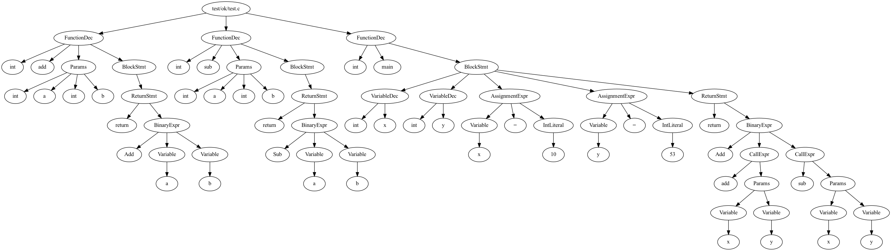

# C-

C-是《Compiler Construction: Principles and Practice》书后介绍的一个精简版的C语言。

To build:

```shell
cargo build --release
```

To run

```shell
./cmm --file <source file>
```

Then compile the .s file with your local compiler, such as

```
clang io.c test.s
```

## 词法分析&语法分析

使用[PEST](https://pest.rs/)提供的[Parsing expression grammars](https://pest.rs/book/grammars/peg.html)，来对词法和语法进行描述。

## 语义分析

## 代码优化

## 代码生成

使用[LLVM]的Rust binding [inkwell](https://github.com/TheDan64/inkwell)。

## 测试

## AST 可视化
使用 [Graphviz](http://graphviz.org) 对 AST 进行可视化。

生成 dot 文件：
```shell
cmm --file <soruce file> --dotfile <dot file>
```

从 dot 文件生成 png 图片：
```shell
dot <dotfile> -T png -o dot.png
```

例如，生成 [test.c](test/ok/test.c) 的 ast 可视化文件：
```shell
cmm --file test/ok/test.c --dotfile ./dotfile
dot dotfile -T png -o ast.png
```


## TODO

- [x] `input`和 `output`函数。
- [ ] 完整的测试。
- [ ] 代码优化。
- [x] 现在不能有全局变量，需要修复。
- [ ] 文档。
- [x] 语法树的可视化。
- [ ] 执行环境。
