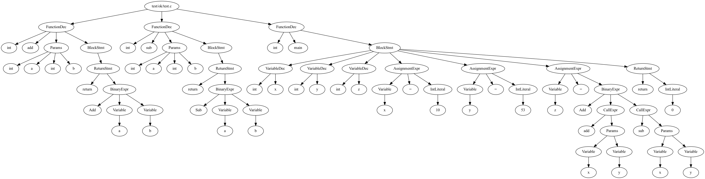

# Cmm

Cmm是《Compiler Construction: Principles and Practice》书后介绍的一个精简版的C语言的实现，略有不同，主要是增加了部分运算符。

程序的使用方法：类似于gcc/clang。通过项目release的deb包进行安装。`cmm source.c`即可进行编译，编译的默认结果为`a.out`。更详细的使用方法查看`cmm --help`。

程序的构建方法：除了[Rust]之外，主要需要llvm的依赖。在Ubuntu中可以使用`sudo apt install llvm`完成依赖安装。llvm的版本可以在`Cargo.toml`进行配置。配置完成后`cargo build`即可进行构建。

程序主要使用的第三方库：

- 词法分析&语法分析: 使用 [PEST](https://pest.rs/) 提供的 [Parsing expression grammars](https://pest.rs/book/grammars/peg.html)，来对词法和语法进行描述。
- 代码生成: 使用 [LLVM](https://llvm.org/) 的Rust binding [inkwell](https://github.com/TheDan64/inkwell)
- 代码优化: 使用 [PassManager](https://thedan64.github.io/inkwell/inkwell/passes/struct.PassManager.html)，基于函数进行优化。
- AST可视化: 使用 [Graphviz](http://graphviz.org) 对 AST 进行可视化。

